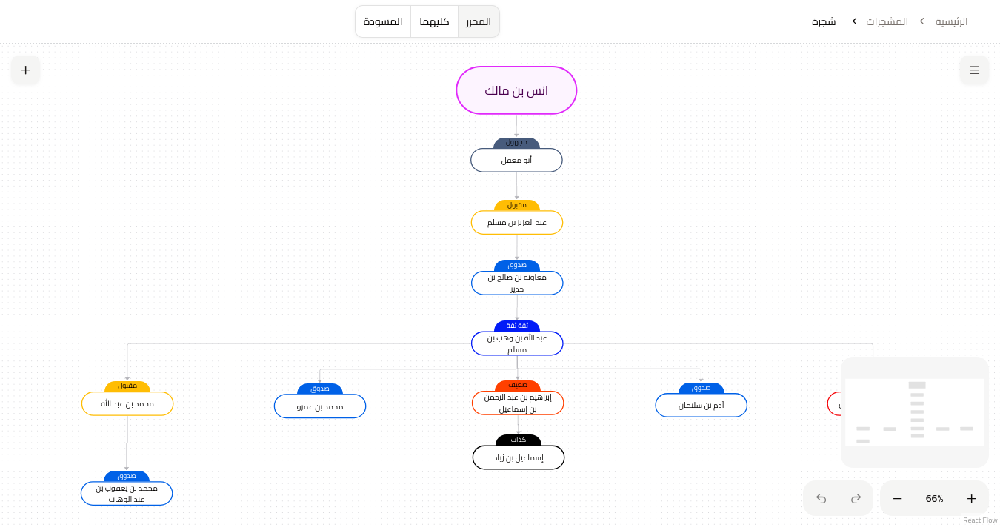

<div align="center">
  
  <h1>Sanad (سند)</h1>
  <p>A web tool for building Hadith isnad trees and exploring narrators</p>


[🇸🇦 العربية](README.ar.md) | [🇺🇸 English](README.md)

</div>

<br/>



<br/>

## 📋 Description

Sanad is a simple web tool that helps students of knowledge and researchers build and explore Hadith isnad trees (تشجير الأسانيد), with narrator information and easier navigation/search across chains.

## 🚀 How to Run Locally

```bash
git clone https://github.com/mohmmedraad/sanad.git
cd sanad
pnpm install
pnpm run dev
```

Make sure you have:

- **Node.js** installed
- **pnpm** installed
- **PostgreSQL** available (local or remote)

### Environment Variables

1. Copy the example env file:

```bash
cp .env.example .env
```

2. Fill the required values in `.env` (at minimum `NEXT_PUBLIC_WEBSITE_URL`, `BETTER_AUTH_SECRET`, and your database variables / `DATABASE_URL`).

### Database

After configuring your database env variables, you can manage schema/migrations via:

```bash
pnpm run db:generate
pnpm run db:migrate
```

## 🤝 How to Contribute

Contributions are welcome.

1. **Fork the repository** and create a new branch
2. **Run checks** before pushing:

```bash
pnpm run check
pnpm run typecheck
```

3. **Open a Pull Request** with a clear description of what you changed and why

## 📄 License

See the license information in this repository.

## 📞 Contact

For questions or suggestions, please open an issue on this repository.
